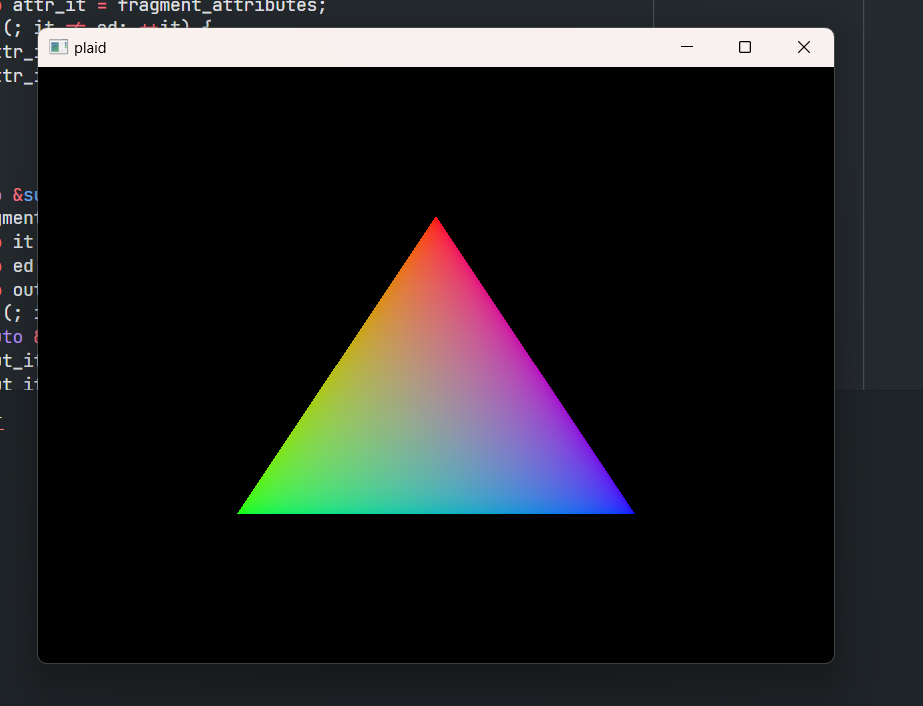

# plaid

[简体中文](README.md)

🚧🚧🚧 UNFINISHED 🚧🚧🚧

plaid is a software renderer in C++。It is consist of two parts:
* `core` The rendering pipeline implementation.
* `viewer` Loading and displaying the model.



### TODO
* The code is so mess，I will try to improve the readability.
* Depth stencil buffer
* Load from glTF

### Environments
* CMake
* Windows SDK 10.0.17134.0 or higher
> `viewer` run on Windows only now，because my window system only written for win32 now.

### Build
```
cmake -B.build
cmake --build .build
```

> If there are any Environment issue/Compiling error/Bug, add it to issue，or send to: julic20s@outlook.com, please.
