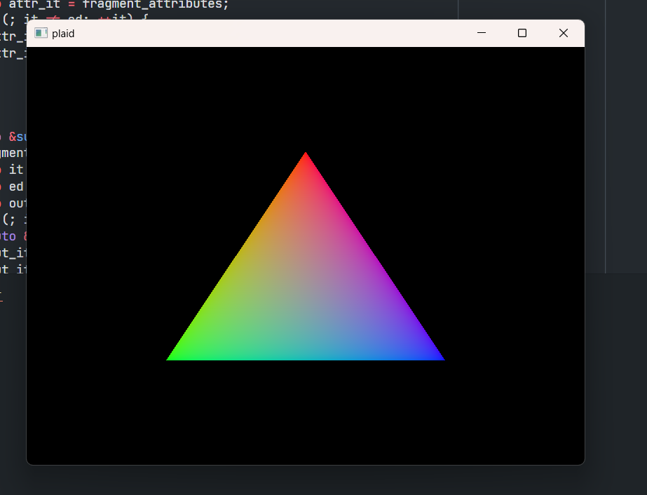

# plaid

[ENGLISH](README-EN.md)

🚧🚧🚧 未完成 🚧🚧🚧

plaid 是一个 C++ 软光栅渲染器。它由三个部分组成:
* `core` 渲染管线框架实现。
* `gltf` 解析 .gltf
* `viewer` 加载并渲染模型。



### TODO
* 代码很乱可读性很差，慢慢优化
* 加载 glTF
* 一个不成熟的想法：用 coroutine 来实现 ddx, ddy 和 mipmap

### 环境需求
* CMake
* Windows SDK 10.0.17134.0 or higher
> `viewer` 现在只能在 Windows 上运行，原因是目前创建窗口只写了 win32 版本的

### 构建
```
cmake -B.build
cmake --build .build
```

> 环境配置/编译问题/Bug 请直接提 issue，或者发我邮箱: julic20s@outlook.com
